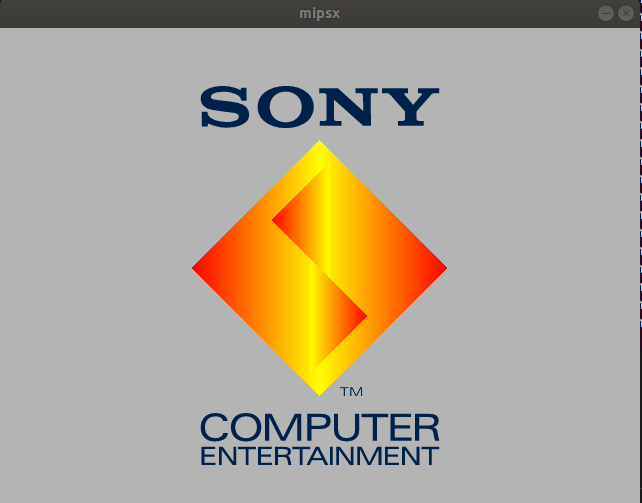

# mipsx


> mips32 + playstation1(psx)  = mipsx

mipsx is a [PlayStation](https://en.wikipedia.org/wiki/PlayStation_(console)) emulator written in C++.



### Building

#### Prerequisites

- PlayStation BIOS: SCPH1001 (SHA1: 10155d8d6e6e832d6ea66db9bc098321fb5e8ebf)

- SDL2

- opengl

- GLEW

  - ```sh
    sudo apt install libglew-dev
    ```

#### Compiling

```shell
$ make clean && make
```


